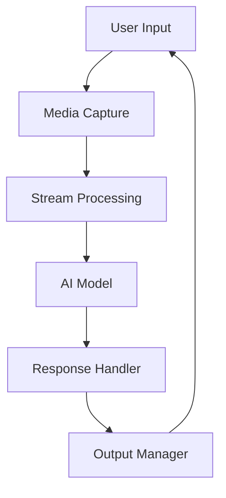

+++
id = "APP-CONTEXT-001"
title = "Overall Application Context"
context_type = "app-context"
status = "active"
last_updated = "2025-05-05"
+++

# Overall Application Context

## Project Scope
Building a multimodal AI chat application that combines:
- Real-time AI interaction
- Multiple input/output modalities
- Cloud integration
- Modern web technologies

## Technology Stack

### 1. Core APIs
- **Gemini API**: Primary AI model integration
- **Puter.js**: Cloud services and infrastructure
- **Web APIs**: Media capture, audio, WebSocket

### 2. Key Services
```javascript
// AI Services
- Text generation
- Image understanding
- Audio processing
- Function calling

// Cloud Services
- File storage
- Key-value store
- Authentication
- Hosting
```

### 3. Frontend Technologies
- Vanilla JavaScript (no framework dependencies)
- WebRTC for media handling
- Web Audio API
- Canvas for visualizations

## Architecture Design

### 1. Core Components

#### Agent Layer
- Central orchestration
- State management
- Resource coordination
- Event handling

#### Service Layer
```javascript
// AI Services
- Model interaction
- Stream processing
- Tool management

// Cloud Integration
- File operations
- Data persistence
- Authentication
- Real-time sync
```

#### Interface Layer
- Media capture
- Audio processing
- Visual feedback
- User interaction

### 2. Data Flow


## Integration Points

### 1. Gemini AI Integration
- WebSocket-based communication
- Real-time streaming support
- Multimodal input handling
- Function calling capabilities

### 2. Puter.js Integration
```javascript
// Core Services
- auth: User authentication
- fs: File system operations
- kv: Data persistence
- hosting: Web deployment

// Additional Features
- UI components
- Cloud storage
- Security handling
```

### 3. Media Integration
- Camera input
- Screen sharing
- Audio streaming
- Speech transcription

## Implementation Strategy

### 1. Core Functionality
1. User Authentication
2. AI Model Connection
3. Media Capture Setup
4. Real-time Communication
5. Data Persistence
6. Output Handling

### 2. Enhanced Features
```javascript
// Advanced Capabilities
- Multi-turn conversations
- Context management
- Tool integration
- Media processing
- Cloud sync
```

### 3. User Experience
- Real-time feedback
- Intuitive controls
- Visual indicators
- Error handling

## Technical Considerations

### 1. Performance
- Stream optimization
- Resource management
- Memory handling
- Connection management

### 2. Security
```javascript
// Security Measures
- API key protection
- Secure communication
- Permission handling
- Resource access control
```

### 3. Scalability
- Resource cleanup
- Connection pooling
- Data chunking
- Cache management

## Best Practices

### 1. Code Organization
- Modular architecture
- Clear separation of concerns
- Event-driven design
- Proper error handling

### 2. Resource Management
```javascript
// Cleanup Patterns
- Ordered resource disposal
- Memory management
- Connection handling
- Stream cleanup
```

### 3. Error Handling
- Graceful degradation
- User feedback
- Recovery mechanisms
- Logging

## Development Guidelines

### 1. Code Structure
- Modular components
- Clear interfaces
- Documentation
- Testing hooks

### 2. Quality Assurance
```javascript
// Testing Areas
- Core functionality
- Media handling
- Error scenarios
- Performance metrics
```

### 3. Maintenance
- Code documentation
- Resource monitoring
- Update management
- Performance tracking

This context provides a comprehensive framework for building a robust, scalable, and user-friendly multimodal AI chat application leveraging modern web technologies and cloud services.